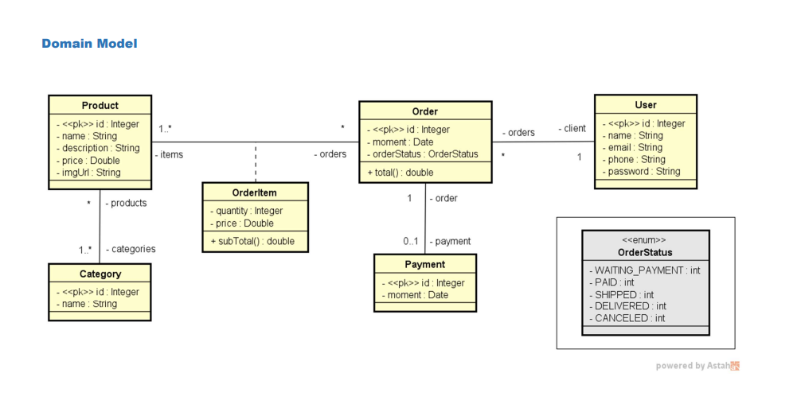
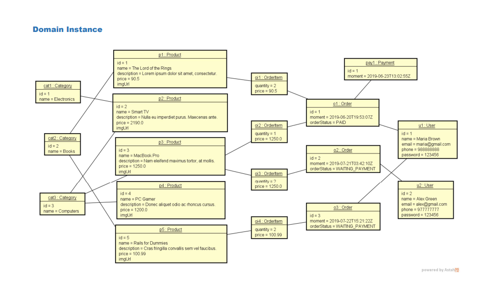
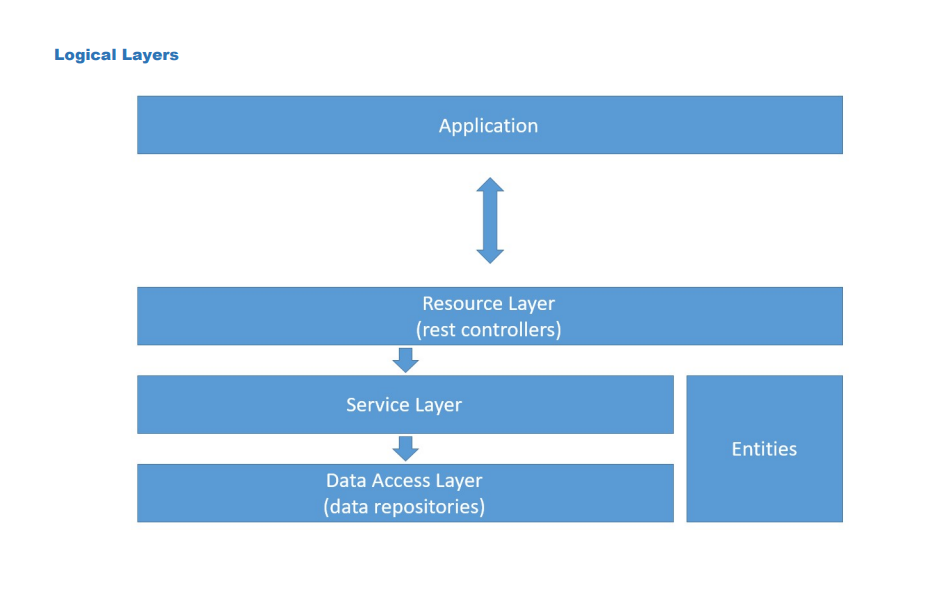

# Projeto web services com Spring Boot e JPA / Hibernate

## Introdução

Este projeto foi desenvolvido como parte do **Curso Java Completo** ministrado pelo Prof. Nelio Alves. Ele tem como objetivo a implementação manual de um CRUD (Create, Read, Update e Delete) completo, utilizando o framework **Spring Boot** com a API **JPA (Java Persistence API)** e **Hibernate**.

O repositório com o projeto pode ser acessado [aqui](https://github.com/hvgofernandes/workshop-springboot3-jpa).

## Propósito do Projeto

- Criar um projeto **Spring Boot Java**.
- Implementar um modelo de domínio.
- Estruturar camadas lógicas: **resource, service, repository**.
- Configurar um banco de dados de teste (**H2**).
- Povoar o banco de dados.
- **CRUD** (Create, Retrieve, Update, Delete).
- Implementar tratamento de exceções.

A aplicação destina-se a elaborar as entidades do negócio com vários tipos de relacionamentos de **"um para muitos", "muitos para um"** e vice-versa. O modelo é dividido em **camadas lógicas** que funcionam no servidor, utilizando-se:

- **Camada Resource**: Controladores **REST (Representational State Transfer)**, que são as interfaces da aplicação back-end, responsáveis por receber requisições e responder de acordo com o comportamento do sistema.
- **Camada de Serviços**: Responsável por implementar as regras de negócio.
- **Camada de Acesso a Dados (Repository)**: Realiza a comunicação direta com o banco de dados.
- **Camada de Entidades**: Contém a estrutura do modelo de domínio da aplicação.

Após configurar o banco de dados relacional para testes e povoar a base de dados, administramos o **CRUD** para gerenciar as operações de cadastro completo da entidade, garantindo também um tratamento eficiente de exceções.

Com a implementação do modelo de domínio, instanciou-se os objetos e criou-se a base de dados relacional, registrando-se automaticamente.

## Sobre o Projeto

O projeto consiste na implementação de um sistema web services para gerenciar um **cadastro de Produtos e seus respectivos Pedidos**, permitindo realizar operações básicas de **CRUD (Create, Read, Update e Delete)**. Os dados são armazenados no banco de dados H2 e a aplicação utiliza **Spring Boot** para manipular as informações.

## Estrutura do Projeto




## Camada Lógica do Projeto



## Tecnologias Utilizadas

### Back End:

- **Java**
- **Spring Boot**
- **Apache Tomcat**
- **Maven**
- **H2** (Banco de dados para testes)
- **Postman** (Ferramenta para testar requisições REST)
- **PostgreSQL** (Banco de dados para produção)
-   
## Aprendizados

Durante o desenvolvimento deste projeto, foi possível aprofundar os conhecimentos sobre:

- Conexão de aplicações Java com bancos de dados usando **Spring Boot**.
- Organização em **camadas lógicas** para maior manutenção e escalabilidade.
- Implementação de **tratamento de exceções** para melhorar a robustez da aplicação.
- Uso de **annotations** para mapeamento de entidades do JPA.
- Desenvolvimento de **APIs Rest**.
- Testes e Depuração com **Postman**.
- Segurança e Autenticação com **JWT (JSON Web Token)**.

## Como Rodar o Projeto Localmente

### **Pré-requisitos:**

- **Java**
- **Spring Boot**
- **Apache Tomcat**
- **Maven**
- **H2**

### **Passos para executar:**

1. Clone o repositório:
   ```bash
   git clone https://github.com/hvgofernandes/workshop-springboot3-jpa
   ```
2. Entre no diretório do projeto:
   ```bash
   cd course
   ```
3. Iniciar a aplicação pela classe CourseApplication.
4. Abrir o banco de dados H2 com a url ``http://localhost:8080/h2-console`` que pode ser encontrada no arquivo ``application-test.properties``
